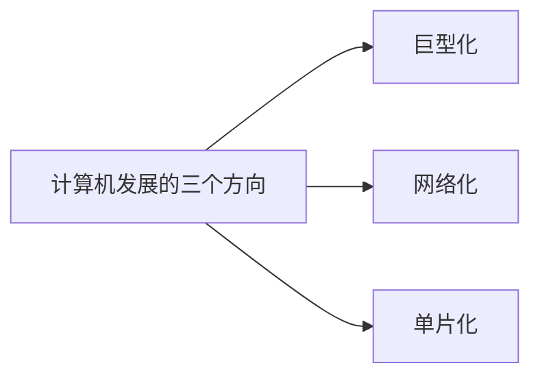
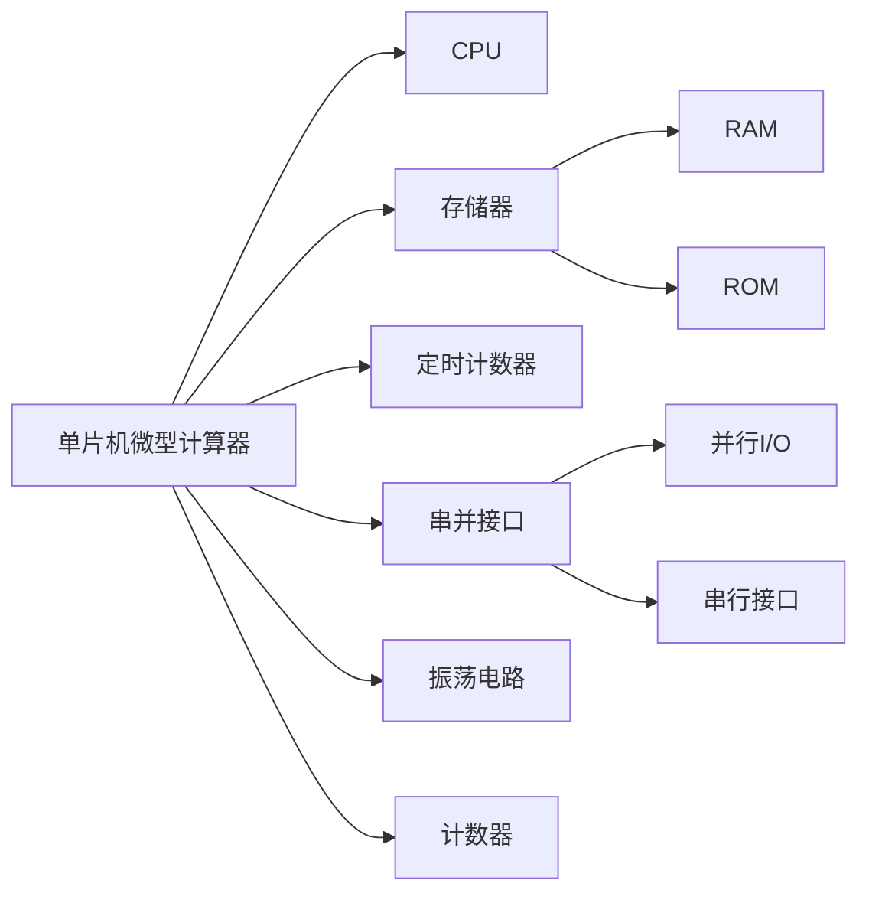

# 单片机绪论-要点

## 计算机发展方向

**Intel**给单片机命名为嵌入式控制器(**embedded microcontroller**).

## 单片机的组成

> 名词缩写:     
单片机:SCM  
中央处理器:CPU  
微处理器:MPU    
微控制器:MCU    

## 单片机的定义

单片机（Single-Chip Microcomputer）是一种集成
电路芯片 是采用超大规模集成电路技术把具有数据处理电路芯片，是采用超大规模集成电路技术把具有数据处理
能力的中央处理器CPU、随机存储器RAM、只读存储器
ROM、多种I/O口和中断系统、定时器/计数器等功能
（可能还包括显示驱动电路、脉宽调制电路、模拟多路转
换器、A/D转换器等电路）集成到一块硅片上构成的一个
小而完善的微型计算机系统，在工业控制领域广泛应用。

## 单片机和CPU、PLC的关系

集成常用芯片(时钟、定时计数器、串并接口、中断、存储器...)   
集成常用电路(CPU+常用芯片=单片机    
单片机+常用电路=PLC)    

从**整体**开发而言:     
基于CPU:CPU系统电路+接口电路+程序...   
基于MCU:接口电路+程序...    
基于PLC:程序...     

从**程序**角度看:   
基于CPU:汇编语言等(或基于OS的各种程序)  
基于MCU:汇编语言/C语言等    
基于PLC:梯形图      